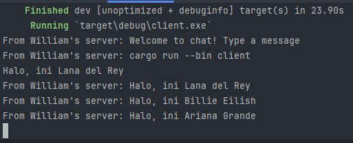
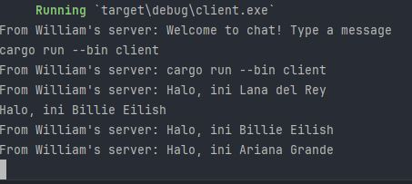
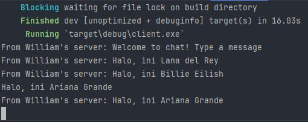

# Tutorial 10 - Advanced Programming - Timer
**William - 2206083432 - C**

### 2.1. Original Code

Pada gambar di atas menunjukan komunikasi dengan/berbasis websocket, artinya ketika client mengirimkan pesan ke server, maka client  lainnya akan mendapatkan pesan tersebut (server mengirimkannya ke semua client)

### 2.2. Modifying the websocket port
Pada server.rs, bagian yang diubah adalah `let listener = TcpListener::bind("127.0.0.1:2000").await?;` menjadi `let listener = TcpListener::bind("127.0.0.1:8080").await?;`
Pada client.rs, bagian yang diubah adalah `let (mut ws_stream, _) = ClientBuilder::from_uri(Uri::from_static("ws://127.0.0.1:2000")).connect().await?;` menjadi `let (mut ws_stream, _) = ClientBuilder::from_uri(Uri::from_static("ws://127.0.0.1:8080")).connect().await?;`

jika perubahan port dilakukan secara konsisten (antara client dan server), maka tidak terjadi error.