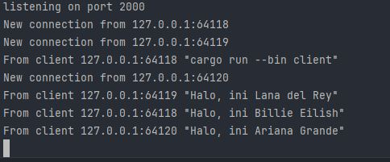

# Tutorial 10 - Advanced Programming - Timer
**William - 2206083432 - C**

### 2.1. Original Code

Pada gambar di atas menunjukan komunikasi dengan/berbasis websocket, artinya ketika client mengirimkan pesan ke server, maka client  lainnya akan mendapatkan pesan tersebut (server mengirimkannya ke semua client)